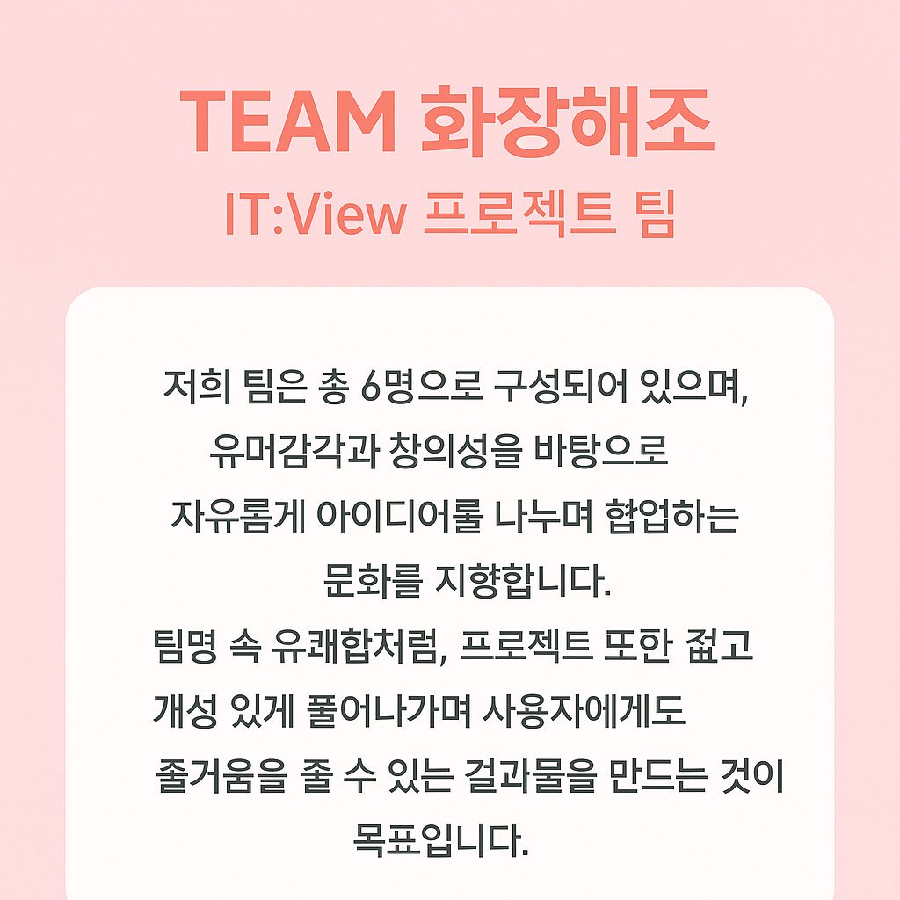
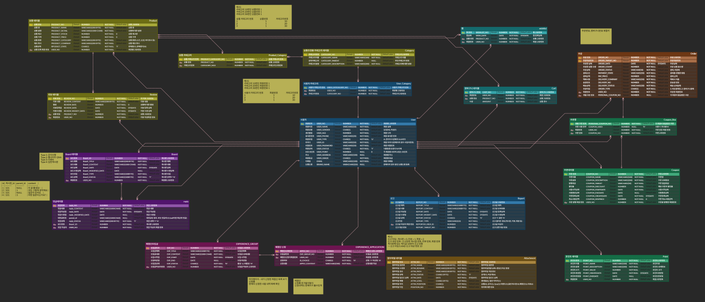
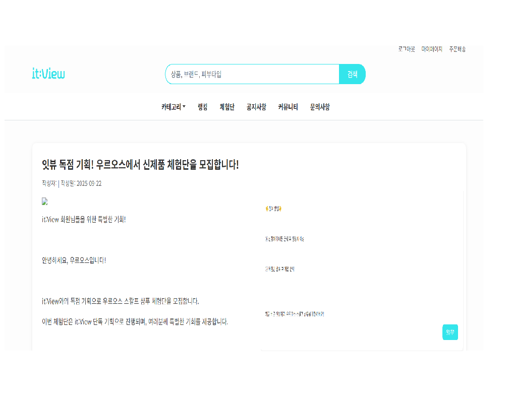
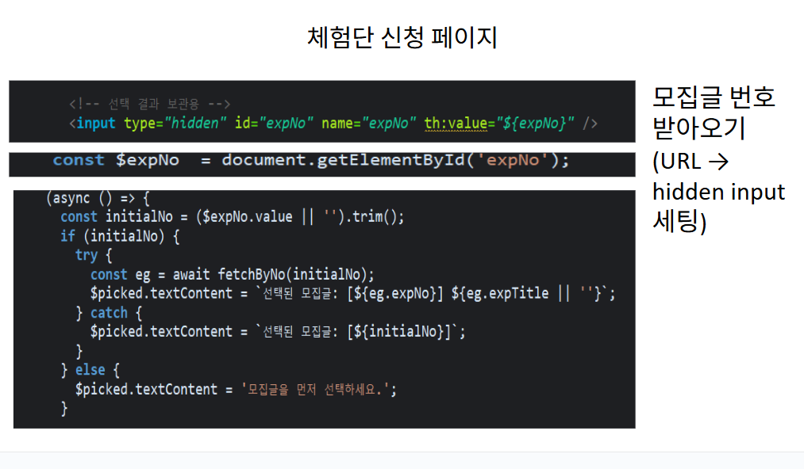
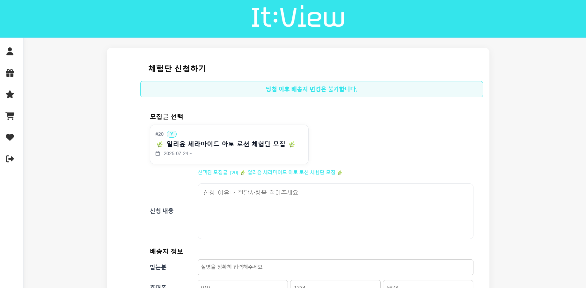
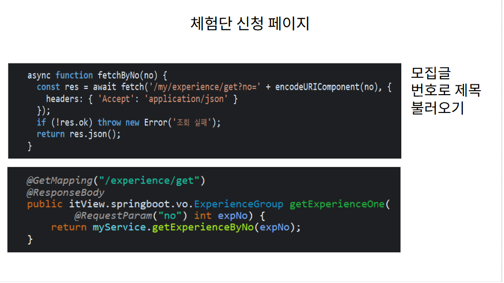
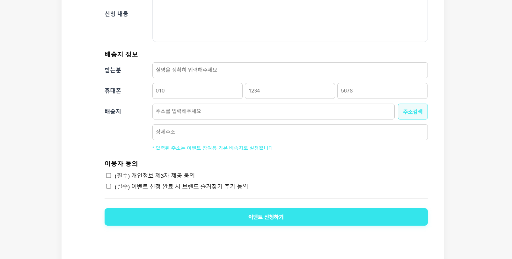
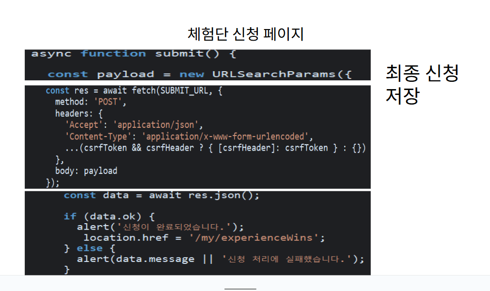

# itview-portfolio
이루강 | IT-View 프로젝트 포트폴리오
# 🧴 IT:VIEW | 이루강

> 사용자 맞춤형 화장품 추천 및 리뷰 커머스 플랫폼  
> React + Spring Boot 기반 웹 프로젝트  
> 담당 파트: **마이페이지 / 체험단 신청 / 리뷰 작성 / 포인트·쿠폰 관리**

---

## 👩‍💻 1. 팀 소개

**팀명:** 화장해조  
**팀원:** 황인호, 김상현, 이루강, 이지원, 양서연, 이기정  

> “화장해조”는 ‘화장해줘’의 발음을 살린 이름으로,  
> 사용자에게 꼭 맞는 화장품을 추천하고 도와주는 서비스를 지향합니다.

---

##  2. 개발 배경 및 목적

### ▪ K-뷰티 시장 성장
- 글로벌 K-뷰티 시장은 2023년 약 **141억 달러 → 2032년 280억 달러** 규모로 성장 전망  
- 화장품 관련 정보는 많지만, 자신의 **피부 상태에 맞는 제품을 효율적으로 찾기 어려움**

### ▪ 개인 맞춤형 서비스 수요 증가
- 사용자는 **성분, 리뷰, 피부 고민** 기반으로 정교한 추천을 원함  
- MZ세대의 **72% 이상이 인플루언서 리뷰 기반 구매 경험**이 있음  
- 이에 따라 **리뷰 기반 체험단 시스템 + 추천 알고리즘**을 결합한 서비스 개발

---

##  3. 개발 목적
1. 사용자 중심의 **화장품 리뷰 및 검색 기능 제공**  
2. 피부 타입 및 관심 성분 기반의 **맞춤형 추천 시스템 구현**  
3. 리뷰·체험단 서비스로 **트렌드형 수익 구조 확립**

---

## 🧩 4. 사용 기술 및 개발환경

| 구분 | 내용 |
|------|------|
| **운영체제** | Windows 11 |
| **사용언어** | Java, HTML, CSS, JavaScript, SQL |
| **Framework / Library** | Spring Boot, Thymeleaf, MyBatis, jQuery |
| **DB** | Oracle DB |
| **Tool** | Eclipse, Visual Studio Code |
| **WAS** | 내장 Tomcat |
| **Collaboration** | GitHub |

---

##  5. 데이터베이스 설계 (ERD)

> 사용자, 상품, 리뷰, 체험단, 쿠폰, 포인트 등 20여 개의 테이블로 구성되어 있으며  
> MyBatis 매핑을 기반으로 CRUD 및 조건별 조회 최적화 구현.

---

##  6. 프로젝트 주요 기능

> 사용자 맞춤형 화장품 추천 및 커뮤니티형 쇼핑 서비스

1. **상품 등록**  
   - 관리자 페이지에서 상품 정보 및 이미지 등록  
   - 다중 이미지 업로드 및 자동 썸네일 생성  

2. **카테고리 및 브랜드 검색**  
   - 카테고리/브랜드별 필터링 기능  
   - Ajax 기반 실시간 검색어 제안  

3. **화장품 체험단 신청**  
   - 사용자 참여형 이벤트 페이지  
   - 모집글 선택 → 정보입력 → 신청 완료 플로우 구현  

4. **피부 타입별 화장품 매칭률 기능**  
   - 사용자 피부 타입 DB 기반 화장품 성분 분석  
   - 매칭률 % 계산 및 시각화 (progress bar 표시)

5. **⭐ 리뷰 작성**
- Toast UI Editor를 활용한 텍스트+이미지 리뷰 작성
- 첨부 이미지 자동 저장 및 썸네일 미리보기
- 비회원 접근 시 로그인 유도 처리
---

##  7. 담당파트 화면 및 코드 리뷰 | 이루강

> **담당 파트:** 사용자 체험단 신청 페이지  
> **핵심 포인트:** URL 파라미터 전달 → 모집글 데이터 호출 → 최종 신청 저장까지의 흐름  

---

---

###  1️⃣ 문제 상황

- 체험단 신청 페이지로 이동 시, **어떤 모집글을 선택했는지 정보가 사라지는 문제** 발생  
- URL을 통해 전달되는 모집글 번호(`expNo`)는 존재하지만,  
  화면이나 서버 요청에서 이 값이 정상적으로 반영되지 않아 **잘못된 데이터로 신청되는 경우**가 생김  

---

###  2️⃣ 원인 분석

- 페이지 전환 시 URL에 포함된 `expNo` 값이 단순히 주소에만 존재하고  
  실제 DOM 내부(`input`, JS 변수 등)에는 반영되지 않음  
- 즉, **URL 파라미터 → 화면 데이터 연결 로직 부재**  
- 또한, 사용자가 직접 URL로 접근할 때 제목이 표시되지 않아  
  “어떤 모집글인지” 직관적으로 확인하기 어려움  

---

###  3️⃣ 해결 방법

#### ✅ (1) URL 파라미터에서 모집글 번호 읽기
- `URLSearchParams` 객체를 사용해 URL의 `expNo` 값을 추출  
- 값을 `hidden input` 요소(`#expNo`)에 세팅하여  
  JS와 서버 모두에서 동일한 데이터를 공유하도록 함

---

###  4️⃣ 핵심 포인트

- **데이터 일관성 확보**  
  → URL, hidden input, 서버 요청 간 동일한 `expNo`를 유지하여 오류 방지

- **사용자 경험(UX) 개선**  
  → 모집글 번호뿐만 아니라 제목을 함께 표시해 사용자가 헷갈리지 않도록 개선

- **API 구조 분리**  
  → 모집글 조회(GET)와 신청 처리(POST)를 명확히 분리하여 코드 가독성 향상

- **중복 신청 방지 및 안정성 강화**  
  → 서버 단에서 중복 검사 후 insert 수행, CSRF 대응 구조로 확장 가능

---

## 🧭 프로젝트 소감 | 이루강

이번 It:View 프로젝트는 단순히 기능 구현에 그치지 않고,  
**‘사용자 중심의 흐름을 설계한다’는 관점으로 접근한 첫 협업 경험**이었습니다.  

체험단 신청 페이지를 구현하면서 URL 파라미터, hidden input, 서버 로직 간 데이터 흐름이  
조금만 어긋나도 전체 기능이 무너질 수 있다는 걸 체감했습니다.  
이 과정을 통해 단순히 "작동하는 코드"보다  
"누가 봐도 명확한 흐름을 가진 코드"의 중요성을 배웠습니다.  

또한 팀원들과 GitHub를 통한 브랜치 관리, 코드 병합 및 충돌 해결 과정을 직접 겪으면서  
**협업에서의 커뮤니케이션 능력과 코드 일관성 유지의 어려움**도 경험했습니다.  
서로의 코드를 이해하고 합치는 과정이 쉽진 않았지만,  
결국 **하나의 완성된 서비스로 결과를 만드는 성취감**이 컸습니다.  

이번 프로젝트를 통해  
👩‍💻 **“기술적인 완성도 + 사용자 경험 + 협업 능력”**  
이 세 가지를 균형 있게 다루는 개발자의 방향성을 다시 한 번 다잡을 수 있었습니다.

